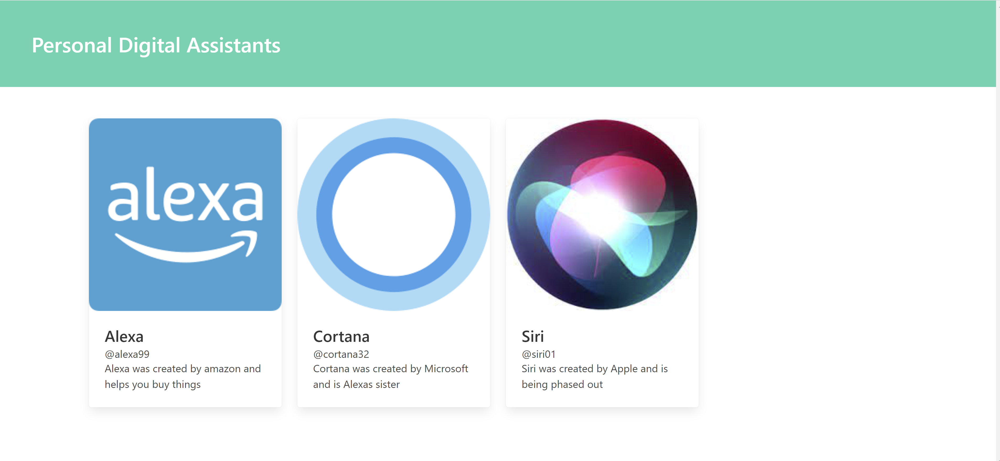

# Vanilla profile card project
## A small non-responsive application, built with REACT and bulma.io library 

click [HERE](https://profile-card-nu-one.vercel.app/) to checkout this project

### Summary
This is a small project that gave me a chance to learn about the bulma.io CSS library, and gave me a chance to use the documentation on building a profile card. I built small cards to introduce specific AI programs used by Apple, Microsoft, and Amazon. 

### Author: Calvin Anthony Lee | Software Developer 
[Github](https://github.com/calvinalee2006) |  [LinkedIn](https://www.linkedin.com/in/calvinalee/) | [Website](https://calvins-react-portfolio.vercel.app/)